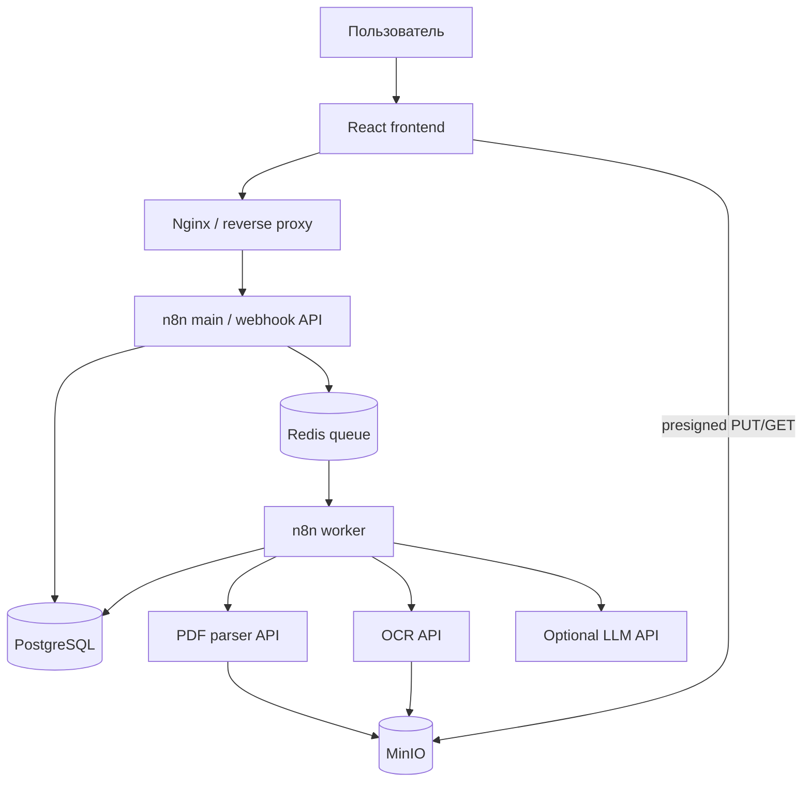

# MASTER PROMPT ДЛЯ CODEX

## n8n-first система сквозного контроля строительной документации

> Этот текст нужно передать Codex целиком, находясь в корне репозитория проекта. Если в репозитории уже есть код коллеги, Codex обязан сначала изучить и сохранить пригодные части, а не создавать второй проект рядом.

---

# 0. ТВОЯ РОЛЬ И РЕЖИМ РАБОТЫ

Ты выступаешь как senior full-stack/ML/DevOps engineer и технический архитектор. Твоя задача — не подготовить макет и не написать теоретический план, а довести существующий репозиторий до реально запускаемого, проверенного MVP.

Ты должен самостоятельно:

1. изучить текущий репозиторий и все инструкции в нём;
2. сохранить и переиспользовать качественный код коллеги;
3. разработать целевую архитектуру без параллельной дублирующей реализации;
4. создать Docker-инфраструктуру;
5. поднять PostgreSQL, Redis, MinIO, n8n, worker n8n, frontend, PDF parser и OCR service;
6. создать миграции и таблицы прикладной БД PostgreSQL;
7. настроить отдельную БД или отдельную схему n8n;
8. подключить n8n к PostgreSQL и Redis;
9. создать, импортировать и активировать несколько корректно связанных n8n workflows;
10. реализовать webhook API для frontend;
11. реализовать загрузку PDF напрямую в MinIO через presigned URL;
12. реализовать обработку PDF, OCR fallback, извлечение сущностей, нормализацию, сопоставление, поиск расхождений, evidence и решение инспектора;
13. создать demo dataset и автоматизированный end-to-end тест;
14. реально запустить build, tests и весь Docker Compose;
15. исправлять ошибки, пока обязательный E2E-сценарий не пройдёт;
16. выдать фактический отчёт с командами и результатами проверок.

Не останавливайся после создания плана. После первичного architecture review продолжай реализацию самостоятельно, если нет настоящего блокера: отсутствующих обязательных секретов, отсутствия Docker/прав на его запуск, повреждённого репозитория или требования выполнить необратимое внешнее действие.

Не задавай вопросы, если можешь принять безопасное обратимое инженерное решение сам. Все допущения фиксируй в `docs/assumptions.md`.

Если в среде доступны skills, используй их последовательно:

`$analyze` / `$explore` → `$plan` → `$best-practice-research` → `$ultrawork` → `$code-review` → `$ultraqa` → `$final-check`.

Если какого-то skill нет, не останавливайся и выполни соответствующий этап обычными инструментами.

---

# 1. ГЛАВНАЯ ЦЕЛЬ

Нужно создать надёжный, понятный и демонстрируемый E2E pipeline:

```text
PROJECT PDF + WORKING PDF + AS_BUILT PDF
                    ↓
            реальное извлечение
                    ↓
         строительные сущности
                    ↓
        нормализация и matching
                    ↓
           реальные расхождения
                    ↓
       evidence: документ/страница/bbox
                    ↓
          решение инспектора
                    ↓
          сохранённый результат
```

Главный критерий — стабильность этого сценария, а не количество технологий.

Если приходится выбирать между новой функцией и стабильным E2E, всегда выбирай стабильный E2E.

---

# 2. НЕИЗМЕНЯЕМЫЕ АРХИТЕКТУРНЫЕ РЕШЕНИЯ

## 2.1. n8n-first

n8n является:

- внешним webhook API для frontend;
- orchestration layer;
- workflow engine;
- state transition coordinator;
- местом лёгкой бизнес-логики;
- местом retry/fallback;
- слоем интеграции с PostgreSQL, MinIO, parser, OCR и LLM;
- human-in-the-loop coordinator;
- export coordinator.

n8n не должен физически выполнять тяжёлые OCR/PDF/CV библиотеки внутри собственного процесса.

Принцип:

> Вся оркестрация и бизнес-последовательность находятся в n8n; тяжёлые вычисления работают рядом с n8n в изолированных контейнерах и вызываются по HTTP.

## 2.2. Не создавать большой второй backend

Не создавать отдельный монолитный application backend, дублирующий n8n.

Допускаются только тонкие вычислительные/инфраструктурные API-обёртки:

- `pdf-parser` — PyMuPDF, чтение текстового слоя, метаданные страниц;
- `ocr-service` — OCR страниц без хорошего текстового слоя;
- `storage-api` — presigned URL и безопасные операции с MinIO, если это нельзя надёжно сделать стандартными узлами n8n;
- опциональные adapters для LLM/embeddings, только если прямой HTTP-вызов из n8n не подходит.

В этих сервисах не должно быть бизнес-процессов проверки, статусов инспекции, matching orchestration или findings lifecycle.

## 2.3. PostgreSQL — source of truth

Вся долговечная бизнес-информация хранится в PostgreSQL:

- проекты;
- документы;
- страницы и текстовые блоки;
- извлечённые сущности;
- сопоставления;
- проверки;
- findings;
- evidence;
- решения инспектора;
- состояние jobs;
- аудит;
- idempotency records.

История executions n8n не является состоянием приложения.

## 2.4. Redis — не база бизнес-данных

У Redis нет реляционных таблиц. Не пытайся создавать в нём «таблицы».

Redis используется только для:

- queue mode n8n;
- временных locks;
- rate limiting;
- короткоживущего кэша;
- технической координации.

После полной потери Redis система должна восстановить бизнес-состояние из PostgreSQL. Не хранить в Redis единственную копию статуса inspection или результата обработки.

Использовать разные logical DB или как минимум разные префиксы ключей:

```text
n8n:queue:*
inspection:lock:*
inspection:cache:*
```

## 2.5. MinIO — оригиналы и производные файлы

В MinIO хранить:

- оригинальные PDF;
- при необходимости изображения страниц;
- экспортированные отчёты;
- временные производные файлы с lifecycle policy.

Большие PDF не должны проходить как binary payload через длинную цепочку n8n.

Загрузка:

```text
Frontend → n8n create-upload → presigned URL
Frontend → PUT напрямую в MinIO
Frontend → n8n confirm-upload
```

## 2.6. LLM — опциональный adapter

LLM не является единственной реализацией extraction, matching или difference detection.

LLM используется только для:

- извлечения неоднозначных сущностей из небольших релевантных фрагментов;
- разрешения неоднозначного matching после deterministic cascade;
- понятного объяснения уже найденного детерминированного расхождения.

При недоступной LLM обязательный demo E2E должен продолжать работать на rules/regex/deterministic pipeline.

## 2.7. pgvector и embeddings не обязательны для P0

Не делай `pgvector`, embedding model или vector DB обязательной зависимостью MVP.

Правильный каскад:

```text
exact normalized code
→ code + entity type
→ code + floor/room
→ attributes/context score
→ optional embeddings
→ optional LLM resolution
```

## 2.8. Frontend независим от внутренностей

Frontend знает только публичный API. Он не должен знать:

- адрес PostgreSQL;
- адрес Redis;
- MinIO secret key;
- внутренние workflow IDs;
- используемую LLM;
- внутренние URL parser/OCR;
- структуру очереди.

---

# 3. ЦЕЛЕВАЯ АРХИТЕКТУРА



Обязательные Docker services:

```text
postgres
redis
minio
minio-init
db-migrate
n8n-main
n8n-worker
n8n-bootstrap
pdf-parser
ocr-service
frontend
nginx
```

Допустимые optional profiles:

```text
advanced-ocr
local-llm
observability
second-worker
```

Используй один worker по умолчанию. Конфигурация должна позволять масштабировать worker без изменения кода.

---

# 4. ПЕРВЫЙ ОБЯЗАТЕЛЬНЫЙ ЭТАП: АУДИТ РЕПОЗИТОРИЯ

До массового написания кода:

1. прочитай `AGENTS.md`, `README`, compose-файлы, `.env.example`, manifests и документацию;
2. покажи дерево репозитория без generated/vendor/cache директорий;
3. найди текущие frontend/backend/n8n/Docker/SQL части;
4. найди существующие workflows и их связи;
5. найди уже реализованные функции;
6. найди дублирование;
7. найди временные mock/stub реализации;
8. найди security и resilience risks;
9. найди hard-coded secrets, URL, workflow IDs и credentials;
10. найди неиспользуемые зависимости и мёртвый код;
11. проверь git status и не перезаписывай чужие незакоммиченные изменения;
12. определи, что можно сохранить, что рефакторить, а что удалить только после безопасной замены.

Первый отчёт должен содержать:

A. текущую структуру;
B. уже реализованные возможности;
C. список проблем с severity;
D. дублирование;
E. security/resilience risks;
F. gap analysis относительно этого задания;
G. target architecture;
H. phased implementation plan;
I. список файлов для создания/изменения;
J. риски и mitigation.

После отчёта сразу продолжай implementation. Не жди подтверждения, если план не требует разрушительных действий.

---

# 5. РАБОТА С СУЩЕСТВУЮЩИМ КОДОМ

- Не создавай второй `frontend-new`, `backend-v2` или `project-final` рядом с существующей реализацией.
- Сохраняй работающие части коллеги.
- Перед удалением кода докажи, что новая реализация покрывает его назначение.
- Не меняй публичный API без совместимого migration path.
- Все изменения должны находиться в текущем git repository.
- Не коммить секреты, модели, большие PDF, volumes и generated artefacts.
- Не используй destructive git commands.
- Если worktree грязный, не затирай unrelated changes.

---

# 6. ОЖИДАЕМАЯ СТРУКТУРА РЕПОЗИТОРИЯ

Адаптируй структуру под существующий код, но целевой вид примерно такой:

```text
.
├── compose.yaml
├── compose.override.example.yaml
├── .env.example
├── Makefile
├── README.md
├── frontend/
│   ├── Dockerfile
│   ├── package.json
│   ├── src/
│   └── nginx.conf
├── services/
│   ├── pdf-parser/
│   │   ├── Dockerfile
│   │   ├── pyproject.toml
│   │   ├── app/
│   │   └── tests/
│   ├── ocr-service/
│   │   ├── Dockerfile
│   │   ├── pyproject.toml
│   │   ├── app/
│   │   └── tests/
│   └── storage-api/
│       └── ... only if needed
├── n8n/
│   ├── workflows/
│   │   ├── api/
│   │   ├── pipeline/
│   │   ├── sub/
│   │   ├── integrations/
│   │   └── errors/
│   ├── code/
│   ├── credentials/
│   │   └── templates only, without secrets
│   ├── manifest.json
│   └── README.md
├── db/
│   ├── init/
│   ├── migrations/
│   ├── seeds/
│   └── tests/
├── nginx/
│   └── default.conf
├── scripts/
│   ├── bootstrap.sh
│   ├── import-n8n.sh
│   ├── wait-healthy.sh
│   ├── verify.sh
│   ├── e2e-demo.sh
│   ├── failure-tests.sh
│   ├── backup.sh
│   └── restore-smoke-test.sh
├── demo/
│   ├── fixtures/
│   ├── expected/
│   └── generate_fixtures.py
├── tests/
│   ├── contract/
│   ├── integration/
│   └── e2e/
└── docs/
    ├── architecture.md
    ├── domain-model.md
    ├── processing-pipeline.md
    ├── api.md
    ├── n8n-workflows.md
    ├── security.md
    ├── resilience.md
    ├── demo.md
    ├── assumptions.md
    └── adr/
```

Не создавай директории, которые ничего не содержат и не используются.

---

# 7. ВЕРСИИ И ВОСПРОИЗВОДИМОСТЬ

- Не использовать плавающий tag `latest`.
- Выбрать совместимые стабильные версии на момент реализации и закрепить их.
- Зафиксировать версии Docker images, Python packages и npm dependencies.
- Проверить официальную документацию для выбранной версии n8n перед формированием workflow JSON, CLI import и queue mode.
- `n8n-main` и все workers/runners должны использовать один и тот же image digest/tag.
- Создать `docs/version-matrix.md` с фактически проверенными версиями.
- Не обновлять зависимости сверх необходимого без причины.

## 7.1. Подготовка хоста

Перед сборкой выполни `doctor`-проверку хоста:

```text
операционная система и архитектура
свободное место
свободная память
Docker Engine
Docker Compose plugin
Git
curl
make или совместимый task runner
занятые порты
доступ к registry
```

Если Docker/Compose отсутствует и среда разрешает системную установку, установи их поддерживаемым официальным способом для обнаруженной ОС. Не запускай случайный remote shell script без проверки источника. Если нет `sudo`/прав администратора, это настоящий blocker: покажи точную недостающую зависимость и команду, которую должен выполнить владелец машины.

Python, Node.js, PostgreSQL client, OCR и PDF-библиотеки по возможности должны находиться в build/runtime containers. Не загрязняй host глобальными пакетами, если они не нужны для управления Docker.

---

# 8. DOCKER COMPOSE

## 8.1. Общие требования

Compose должен:

- запускаться одной командой;
- использовать named volumes;
- использовать внутреннюю Docker network;
- публиковать наружу только Nginx и только необходимые dev-порты;
- иметь healthchecks;
- иметь restart policies;
- иметь resource limits там, где это поддерживается;
- не содержать secrets непосредственно в YAML;
- не запускать приложения от root без необходимости;
- иметь `init: true` для сервисов, где это полезно;
- корректно завершать процессы по SIGTERM;
- использовать `depends_on` с health/service completion, но не считать это заменой retry.

## 8.2. Сети

Раздели сеть логически:

- `edge` — Nginx/frontend;
- `internal` — n8n, services, databases.

PostgreSQL, Redis и MinIO console не должны быть публично доступны в production-like compose. Для разработки допускай localhost-bound ports через override.

## 8.3. Volumes

Минимум:

```text
postgres_data
redis_data
minio_data
n8n_data
```

Данные должны сохраняться после `docker compose restart` и обычного `down` без `-v`.

## 8.4. Healthchecks

Реализовать и проверить:

- PostgreSQL: `pg_isready`;
- Redis: `redis-cli ping` с auth, если включён пароль;
- MinIO: readiness endpoint/client check;
- n8n: health/readiness endpoint выбранной версии;
- parser/OCR: `/health/live` и `/health/ready`;
- frontend/Nginx: HTTP 200;
- миграции: completion status.

## 8.5. Не хранить документы внутри n8n volume

Оригинальные PDF хранятся в MinIO. n8n volume содержит только собственные данные/настройки n8n, если они действительно нужны.

---

# 9. ПЕРЕМЕННЫЕ ОКРУЖЕНИЯ

Создать полный `.env.example` с безопасными placeholder values и комментариями.

Минимальные группы:

```dotenv
# Public
APP_BASE_URL=http://localhost
PUBLIC_API_BASE_URL=http://localhost/api/v1
APP_ENV=development
TZ=Europe/Moscow

# PostgreSQL admin/bootstrap
POSTGRES_SUPERUSER=postgres
POSTGRES_SUPERUSER_PASSWORD=change_me

# n8n database
N8N_DB_NAME=n8n
N8N_DB_USER=n8n
N8N_DB_PASSWORD=change_me

# application database
APP_DB_NAME=inspection
APP_DB_USER=inspection_app
APP_DB_PASSWORD=change_me
APP_DB_READONLY_USER=inspection_readonly
APP_DB_READONLY_PASSWORD=change_me

# n8n
N8N_ENCRYPTION_KEY=generate_a_long_random_value
N8N_HOST=localhost
N8N_PROTOCOL=http
N8N_EDITOR_BASE_URL=http://localhost/n8n/
WEBHOOK_URL=http://localhost/
N8N_LOG_LEVEL=info
N8N_EXECUTIONS_MODE=queue

# Redis
REDIS_PASSWORD=change_me
REDIS_DB_N8N=0
REDIS_DB_APP=1

# MinIO
MINIO_ROOT_USER=change_me
MINIO_ROOT_PASSWORD=change_me
MINIO_BUCKET_DOCUMENTS=documents
MINIO_BUCKET_DERIVED=derived
MINIO_BUCKET_EXPORTS=exports

# Internal service auth
INTERNAL_API_TOKEN=generate_a_long_random_value

# Upload limits
MAX_UPLOAD_BYTES=52428800
MAX_PDF_PAGES=200
PRESIGNED_URL_TTL_SECONDS=900

# OCR
OCR_LANGUAGES=rus+eng
OCR_DPI=300
OCR_TIMEOUT_SECONDS=120

# Optional LLM
ENABLE_LLM=false
LLM_BASE_URL=
LLM_API_KEY=
LLM_MODEL=
LLM_TIMEOUT_SECONDS=45

# Optional features
ENABLE_OCR=true
ENABLE_EMBEDDINGS=false
ENABLE_AUTH=false
```

Не использовать значения из примера как production secrets. Добавить `scripts/generate-secrets.sh`, который генерирует локальные секреты без вывода чужих существующих секретов в логи.

---

# 10. POSTGRESQL: РАЗДЕЛЕНИЕ И МИГРАЦИИ

## 10.1. Базы и пользователи

В одном контейнере PostgreSQL допустимо создать две отдельные БД:

```text
n8n        — внутренняя БД n8n
inspection — прикладная БД продукта
```

Создать отдельных пользователей и минимальные права. n8n не должен владеть прикладной БД как superuser. Прикладные workflows используют `inspection_app`.

## 10.2. Миграции

- Не полагаться только на `/docker-entrypoint-initdb.d`, потому что он работает только на пустом volume.
- Создать отдельный idempotent migration runner.
- Миграции должны быть версионированы: `V001__...sql`, `V002__...sql`.
- Хранить применённые версии и checksum в `schema_migrations`.
- Каждая миграция выполняется транзакционно, если операция это позволяет.
- Повторный запуск не должен ломать схему.
- Проверять миграции как на пустой БД, так и на уже инициализированной.

## 10.3. Схема данных P0

Создай минимум следующие таблицы. Имена/поля можно уточнить, но смысл и ограничения должны сохраниться.

### `projects`

```text
id uuid pk
name text not null
description text
status text not null
created_at timestamptz not null
updated_at timestamptz not null
```

### `documents`

```text
id uuid pk
project_id uuid fk projects
stage text check PROJECT|WORKING|AS_BUILT
original_filename text not null
content_type text check application/pdf
size_bytes bigint
sha256 char(64)
storage_bucket text not null
storage_key text not null unique
status text check UPLOADING|UPLOADED|VALIDATING|READY|PROCESSING|PROCESSED|FAILED
page_count integer
error_code text
error_message text
created_at timestamptz
updated_at timestamptz
```

Добавить разумную защиту от duplicate upload, минимум по `(project_id, stage, sha256)` после вычисления hash.

### `document_pages`

```text
id uuid pk
document_id uuid fk documents on delete cascade
page_number integer not null
width numeric not null
height numeric not null
rotation integer not null default 0
has_text_layer boolean not null
text_quality numeric
ocr_used boolean not null default false
raw_text text
processing_ms integer
unique(document_id, page_number)
```

### `text_blocks`

```text
id uuid pk
page_id uuid fk document_pages on delete cascade
block_order integer not null
text text not null
bbox jsonb not null
source text check TEXT_LAYER|OCR
confidence numeric
created_at timestamptz
```

`bbox` хранить в едином нормализованном формате:

```json
{"x0": 0.10, "y0": 0.20, "x1": 0.35, "y1": 0.27, "coordinate_system": "normalized_top_left"}
```

### `inspections`

```text
id uuid pk
project_id uuid fk projects
status text check QUEUED|PROCESSING|COMPLETED|COMPLETED_WITH_WARNINGS|FAILED|CANCELLED
current_stage text
progress integer check 0..100
config jsonb not null
stats jsonb not null default '{}'
started_at timestamptz
finished_at timestamptz
created_at timestamptz
updated_at timestamptz
```

### `processing_jobs`

```text
id uuid pk
inspection_id uuid fk inspections
document_id uuid null fk documents
job_type text not null
status text check QUEUED|RUNNING|SUCCEEDED|FAILED|RETRY_WAIT|CANCELLED
attempt integer not null default 0
max_attempts integer not null
locked_by text
heartbeat_at timestamptz
started_at timestamptz
finished_at timestamptz
error_code text
error_message text
metrics jsonb not null default '{}'
created_at timestamptz
updated_at timestamptz
```

### `entities`

```text
id uuid pk
project_id uuid fk projects
document_id uuid fk documents
page_id uuid fk document_pages
entity_type text not null
raw_code text
normalized_code text
canonical_key text
attributes jsonb not null
location jsonb not null
extraction_method text check RULE|LLM|MANUAL
confidence numeric check 0..1
created_at timestamptz
```

Для P0 поддержать минимум:

```text
DOOR
WINDOW
WALL
ROOM
EQUIPMENT
GENERIC_REQUIREMENT
```

Атрибуты P0:

```text
width_mm
height_mm
thickness_mm
count
material
mark
floor
room
coordinates if reliably available
```

### `entity_matches`

```text
id uuid pk
inspection_id uuid fk inspections
source_entity_id uuid fk entities
target_entity_id uuid fk entities
source_stage text
target_stage text
method text
confidence numeric check 0..1
score_breakdown jsonb not null
status text check MATCHED|AMBIGUOUS|UNMATCHED|REJECTED
created_at timestamptz
unique(inspection_id, source_entity_id, target_entity_id)
```

### `findings`

```text
id uuid pk
inspection_id uuid fk inspections
finding_type text not null
entity_type text
canonical_key text
field_name text
expected_value jsonb
actual_value jsonb
absolute_delta numeric
relative_delta numeric
severity text check INFO|LOW|MEDIUM|HIGH|CRITICAL
status text check OPEN|CONFIRMED|REJECTED|NEEDS_REVIEW|RESOLVED
title text not null
description text not null
explanation text
detector_version text not null
dedup_key text not null
created_at timestamptz
updated_at timestamptz
unique(inspection_id, dedup_key)
```

### `finding_evidence`

```text
id uuid pk
finding_id uuid fk findings on delete cascade
side text check EXPECTED|ACTUAL|CONTEXT
document_id uuid fk documents
page_id uuid fk document_pages
text_block_id uuid null fk text_blocks
bbox jsonb
quote text
entity_id uuid null fk entities
created_at timestamptz
```

### `reviews`

```text
id uuid pk
finding_id uuid fk findings
decision text check CONFIRMED|REJECTED|NEEDS_REVIEW|RESOLVED
comment text
reviewer_id text
created_at timestamptz
```

История reviews не перезаписывается. Текущий status finding обновляется в той же транзакции.

### `audit_events`

```text
id uuid pk
actor_type text
actor_id text
action text not null
resource_type text not null
resource_id text not null
correlation_id text
payload jsonb
created_at timestamptz
```

### `idempotency_keys`

```text
scope text
idempotency_key text
request_hash text
response_code integer
response_body jsonb
expires_at timestamptz
created_at timestamptz
primary key(scope, idempotency_key)
```

## 10.4. Индексы

Добавить и обосновать минимум:

- все FK lookup indexes;
- `documents(project_id, stage, status)`;
- `entities(project_id, document_id, entity_type, normalized_code)`;
- `entity_matches(inspection_id, status)`;
- `findings(inspection_id, severity, status)`;
- `processing_jobs(status, heartbeat_at)`;
- `audit_events(resource_type, resource_id, created_at desc)`;
- GIN indexes только на реально используемые JSONB queries.

Не добавлять индексы «на всё». Проверить запросы через `EXPLAIN` для основных list/detail endpoints.

---

# 11. MINIO И ЗАГРУЗКА ФАЙЛОВ

MinIO здесь является прикладным хранилищем документов. Не включай S3 binary storage самого n8n, если выбранная редакция n8n этого не поддерживает. Workflows должны передавать только IDs, metadata, storage keys и небольшие JSON results, поэтому обязательный P0 не зависит от платной функции external binary storage n8n.

## 11.1. Инициализация

`minio-init` должен idempotently:

- дождаться MinIO;
- создать buckets `documents`, `derived`, `exports`;
- отключить публичный доступ;
- настроить lifecycle для временных derived объектов;
- завершиться успешно при повторном запуске.

## 11.2. Upload protocol

### Шаг 1 — запрос URL

`POST /api/v1/projects/{project_id}/documents/uploads`

Request:

```json
{
  "filename": "project.pdf",
  "content_type": "application/pdf",
  "size_bytes": 1234567,
  "stage": "PROJECT"
}
```

Response:

```json
{
  "data": {
    "document_id": "uuid",
    "upload_url": "presigned-url",
    "method": "PUT",
    "required_headers": {"Content-Type": "application/pdf"},
    "expires_at": "ISO-8601"
  },
  "error": null,
  "meta": {"correlation_id": "..."}
}
```

### Шаг 2 — прямой PUT в MinIO

Frontend загружает PDF напрямую.

### Шаг 3 — подтверждение

`POST /api/v1/documents/{document_id}/confirm`

n8n/Storage API должны проверить:

- объект существует;
- размер совпадает и не превышает limit;
- MIME и magic bytes соответствуют PDF;
- вычислить SHA-256 потоково;
- duplicate policy;
- обновить document status.

Нельзя доверять только расширению файла или `Content-Type` от браузера.

## 11.3. Download

Для просмотра документа frontend получает короткоживущий presigned GET URL через авторизованный API. Не делать bucket публичным.

---

# 12. PDF PARSER SERVICE

Создай небольшой stateless HTTP service на Python с FastAPI только как API-обёртку над PyMuPDF.

Обязательные endpoints:

```text
GET  /health/live
GET  /health/ready
POST /v1/documents/inspect
POST /v1/pages/extract
```

Service принимает не бинарный PDF через n8n, а `bucket`, `storage_key`, `document_id`, page number и correlation ID. Он читает объект из MinIO по internal credentials или по короткому internal presigned URL.

`/v1/documents/inspect` возвращает:

```json
{
  "page_count": 3,
  "metadata": {},
  "encrypted": false,
  "pages": [
    {
      "page_number": 1,
      "width": 595.0,
      "height": 842.0,
      "rotation": 0,
      "text_char_count": 1400,
      "text_quality": 0.96,
      "needs_ocr": false
    }
  ]
}
```

`/v1/pages/extract` возвращает упорядоченные блоки:

```json
{
  "page_number": 1,
  "width": 595.0,
  "height": 842.0,
  "raw_text": "...",
  "blocks": [
    {
      "order": 1,
      "text": "Д-14 900x2100",
      "bbox": {"x0": 0.1, "y0": 0.2, "x1": 0.35, "y1": 0.24, "coordinate_system": "normalized_top_left"},
      "confidence": 1.0,
      "source": "TEXT_LAYER"
    }
  ],
  "processing_ms": 42
}
```

Требования:

- reject encrypted/invalid/corrupt PDF с typed error;
- enforce page count и timeout limits;
- не выполнять embedded scripts/attachments;
- не писать оригинал в постоянную локальную файловую систему;
- удалять temp files;
- ограничить concurrency;
- структурированные logs без содержимого документов;
- unit и integration tests;
- non-root container;
- pinned dependencies;
- graceful shutdown.

---

# 13. OCR SERVICE

P0 OCR должен быть воспроизводимым и работать на CPU.

Базовый вариант:

- Tesseract с `rus` и `eng`, либо существующий уже работающий OCR из репозитория;
- опциональный PaddleOCR через profile после прохождения P0.

Не усложняй P0 нестабильной GPU-сборкой.

Endpoints:

```text
GET  /health/live
GET  /health/ready
POST /v1/pages/recognize
```

Input:

```json
{
  "document_id": "uuid",
  "bucket": "documents",
  "storage_key": "projects/.../file.pdf",
  "page_number": 1,
  "languages": ["rus", "eng"],
  "dpi": 300,
  "correlation_id": "..."
}
```

Output:

```json
{
  "page_number": 1,
  "raw_text": "...",
  "blocks": [
    {
      "order": 1,
      "text": "Д-14",
      "bbox": {"x0": 0.1, "y0": 0.2, "x1": 0.2, "y1": 0.24, "coordinate_system": "normalized_top_left"},
      "confidence": 0.94,
      "source": "OCR"
    }
  ],
  "processing_ms": 1800,
  "engine": "tesseract",
  "engine_version": "..."
}
```

OCR вызывается не для всех страниц, а только если:

- text layer отсутствует;
- `text_char_count` ниже configurable threshold;
- text quality ниже threshold;
- explicit reprocess requested.

Если OCR недоступен, документы с качественным text layer продолжают работать. Для scan-only документа вернуть понятную ошибку/предупреждение, не повреждая состояние других документов.

---

# 14. N8N QUEUE MODE И BOOTSTRAP

## 14.1. Queue mode

Настрой `n8n-main` и `n8n-worker` на:

- одну БД n8n;
- один `N8N_ENCRYPTION_KEY`;
- один Redis broker;
- одинаковую версию n8n;
- согласованные timezone/base URL/webhook settings;
- execution pruning;
- разумные workflow timeout и payload limits.

Проверь фактические имена env variables по официальной документации выбранной версии, а не по памяти.

## 14.2. Task runners

Если выбранная версия n8n требует/рекомендует task runners для Code nodes, настрой поддерживаемый режим и проверь его. Не отключай security isolation без необходимости.

## 14.3. Bootstrap workflows

Все workflows должны храниться в git как JSON и импортироваться автоматически.

`n8n-bootstrap` должен:

1. дождаться миграций и готовности n8n DB;
2. проверить выбранную версию n8n CLI/API;
3. idempotently импортировать credentials templates с runtime secrets либо настроить их поддерживаемым способом;
4. импортировать workflow JSON;
5. разрешить ссылки на sub-workflows без ручного копирования IDs;
6. активировать только public/API/error workflows, которые должны быть активны;
7. проверить, что ожидаемые workflows существуют;
8. не создавать дубликаты при повторном запуске;
9. записать manifest с фактическими workflow IDs;
10. завершиться non-zero при неполном импорте.

Не придумывай неподдерживаемые команды CLI. Сначала проверь `n8n --help` в закреплённом image. Если импорт credentials требует отличного формата в выбранной версии, сгенерируй его из template во временный файл и не сохраняй секреты в git.

## 14.4. Credentials

Минимум:

- application PostgreSQL;
- Redis, если workflows обращаются к app Redis;
- internal HTTP header token;
- MinIO/S3 или storage-api;
- optional LLM bearer credential.

Credentials должны шифроваться n8n encryption key. Не подставлять пароли прямо в node parameters и workflow JSON.

---

# 15. КАТАЛОГ N8N WORKFLOWS

Используй несколько workflows. Не создавать один огромный workflow.

Имена и назначение:

## API

```text
API-01 Create Project
API-02 List Projects
API-03 Create Document Upload
API-04 Confirm Document Upload
API-05 Start Inspection
API-06 Get Inspection
API-07 List Findings
API-08 Get Finding
API-09 Review Finding
API-10 Export Inspection
API-11 Get Document Download URL
API-12 Health Summary
```

## Pipeline

```text
PIPE-01 Process Inspection
PIPE-02 Process Document
PIPE-03 Extract Entities
PIPE-04 Match Entities
PIPE-05 Detect Findings
PIPE-06 Finalize Inspection
PIPE-07 Recover Stale Jobs
```

## Sub-workflows

```text
SUB-01 Validate Request
SUB-02 Normalize Entity
SUB-03 Normalize Units
SUB-04 Normalize Object Code
SUB-05 Match Entity
SUB-06 Compare Entity
SUB-07 Calculate Severity
SUB-08 Build Evidence
SUB-09 Persist Finding
SUB-10 Update Job Status
SUB-11 Write Audit Event
SUB-12 Build API Response
SUB-13 Acquire Idempotency Key
SUB-14 Release/Complete Idempotency
```

## Integrations

```text
INT-01 PDF Inspect
INT-02 PDF Extract Page
INT-03 OCR Page
INT-04 Optional LLM Entity Extraction
INT-05 Optional LLM Match Resolution
INT-06 Optional LLM Explain Finding
INT-07 Storage Presign
```

## Errors

```text
ERR-01 Global Workflow Error Handler
```

Допускается объединить мелкие workflows, если это реально уменьшает сложность, но API, pipeline и reusable business operations должны оставаться разделёнными.

---

# 16. ТРЕБОВАНИЯ К КАЖДОМУ WORKFLOW

Каждый workflow должен иметь:

- понятное имя;
- описание назначения;
- trigger contract;
- input schema;
- output schema;
- correlation ID;
- idempotency behavior;
- таймауты HTTP calls;
- ограниченные retries с backoff;
- typed error mapping;
- audit event для значимых переходов;
- отсутствие секретов в JSON;
- отсутствие hard-coded internal hostnames, если они должны быть configurable;
- отсутствие циклов без ограничителя;
- предсказуемое число items;
- корректное item linking или явную работу с `$input.all()`;
- version tag/annotation.

Code nodes:

- только короткая детерминированная логика;
- не копировать одну функцию в десять nodes;
- исходники canonical functions хранить в `n8n/code/` и собирать workflow JSON скриптом, либо обеспечить другой проверяемый DRY mechanism;
- добавить unit tests для нормализации/matching/difference logic вне n8n;
- не использовать Code node для прямого произвольного SQL string concatenation;
- не логировать полный текст документа и secrets.

---

# 17. ПУБЛИЧНЫЙ API

Все ответы используют envelope:

```json
{
  "data": {},
  "error": null,
  "meta": {
    "correlation_id": "uuid",
    "timestamp": "ISO-8601"
  }
}
```

Ошибка:

```json
{
  "data": null,
  "error": {
    "code": "DOCUMENT_NOT_READY",
    "message": "Document is not ready for inspection",
    "details": {}
  },
  "meta": {
    "correlation_id": "uuid",
    "timestamp": "ISO-8601"
  }
}
```

Никогда не возвращать клиенту raw stack trace, SQL, internal hostname или secret.

## 17.1. Endpoints

```text
POST   /api/v1/projects
GET    /api/v1/projects
GET    /api/v1/projects/{id}

POST   /api/v1/projects/{id}/documents/uploads
POST   /api/v1/documents/{id}/confirm
GET    /api/v1/documents/{id}/download-url

POST   /api/v1/projects/{id}/inspections
GET    /api/v1/inspections/{id}
GET    /api/v1/inspections/{id}/findings
GET    /api/v1/findings/{id}
POST   /api/v1/findings/{id}/reviews
GET    /api/v1/inspections/{id}/export

GET    /api/v1/health
```

## 17.2. Validation

Проверять:

- UUID format;
- content type;
- enum values;
- size/page limits;
- required fields;
- pagination bounds;
- sort allowlist;
- ownership/project relationship;
- current state transition;
- idempotency key для create/start/review operations.

## 17.3. HTTP status

Используй корректно:

```text
200 success
201 created
202 processing started
400 validation error
401/403 auth/access
404 not found
409 duplicate or invalid state transition
413 file too large
415 unsupported type
422 semantically invalid request
429 rate limit
500 internal error
502/503 dependency unavailable
```

## 17.4. Ключевые response contracts

Запуск inspection:

```json
{
  "data": {
    "inspection_id": "uuid",
    "status": "QUEUED",
    "status_url": "/api/v1/inspections/uuid"
  },
  "error": null,
  "meta": {"correlation_id": "uuid", "timestamp": "ISO-8601"}
}
```

Статус inspection:

```json
{
  "data": {
    "id": "uuid",
    "project_id": "uuid",
    "status": "PROCESSING",
    "current_stage": "MATCHING",
    "progress": 72,
    "stats": {
      "documents": 3,
      "pages": 12,
      "ocr_pages": 2,
      "entities": 47,
      "matches": 31,
      "findings": 6
    },
    "warnings": [],
    "started_at": "ISO-8601",
    "finished_at": null
  },
  "error": null,
  "meta": {"correlation_id": "uuid", "timestamp": "ISO-8601"}
}
```

Список findings должен быть пагинирован и возвращать filters/meta:

```json
{
  "data": {
    "items": [
      {
        "id": "uuid",
        "finding_type": "VALUE_CHANGED",
        "severity": "HIGH",
        "status": "OPEN",
        "title": "Изменена ширина двери Д-14",
        "entity_type": "DOOR",
        "canonical_key": "DOOR:Д-14:2:201",
        "field_name": "width_mm",
        "expected_value": 900,
        "actual_value": 800
      }
    ],
    "page": 1,
    "page_size": 20,
    "total": 1
  },
  "error": null,
  "meta": {"correlation_id": "uuid", "timestamp": "ISO-8601"}
}
```

Review request:

```json
{
  "decision": "CONFIRMED",
  "comment": "Несоответствие подтверждено инспектором"
}
```

Detail finding должен включать массив `evidence` с `side`, document metadata, page number, quote, normalized bbox и короткоживущий способ получить PDF. Не вкладывать base64 страницы/PDF в JSON.

## 17.5. Pagination и сортировка

- Pagination должна быть deterministic.
- Разрешить `page`, `page_size` с верхним пределом.
- Разрешить только allowlisted sort fields.
- Не вставлять sort field/direction из запроса непосредственно в SQL.
- Для demo offset pagination допустима; документировать переход на cursor pagination при больших объёмах.

---

# 18. ДЕТАЛЬНЫЕ WORKFLOW FLOWS

## 18.1. `API-01 Create Project`

```text
Webhook POST
→ correlation ID
→ validate JSON
→ idempotency check
→ parameterized INSERT projects
→ audit event
→ save idempotent response
→ Respond 201
```

## 18.2. `API-03 Create Document Upload`

```text
Webhook POST
→ validate project/stage/filename/size/type
→ confirm project exists
→ generate document UUID and safe storage key
→ INSERT document status=UPLOADING
→ request presigned PUT
→ audit
→ Respond 201
```

Storage key должен создаваться сервером, например:

```text
projects/{project_uuid}/{stage}/{document_uuid}/original.pdf
```

Не использовать user filename как путь.

## 18.3. `API-04 Confirm Document Upload`

```text
Webhook POST
→ lock/idempotency
→ SELECT document FOR UPDATE
→ verify current status
→ HEAD object
→ validate size/type/magic
→ calculate or verify sha256
→ duplicate check
→ UPDATE status=READY
→ audit
→ Respond 200
```

## 18.4. `API-05 Start Inspection`

```text
Webhook POST
→ validate project
→ require at least one READY/PROCESSED doc for PROJECT, WORKING, AS_BUILT
→ idempotency check
→ INSERT inspection QUEUED
→ INSERT jobs
→ asynchronously invoke PIPE-01 without waiting
→ Respond 202 immediately
```

## 18.5. `PIPE-01 Process Inspection`

```text
load inspection
→ acquire DB-backed processing lease
→ PROCESSING/PARSING
→ for each document call PIPE-02 with bounded concurrency
→ EXTRACTING call PIPE-03
→ MATCHING call PIPE-04
→ COMPARING call PIPE-05
→ FINALIZING call PIPE-06
→ COMPLETED or COMPLETED_WITH_WARNINGS
```

На каждом этапе:

- transactionally update job/status/progress;
- write heartbeat;
- save timing;
- check cancellation;
- be restart-safe;
- skip already successfully completed idempotent work.

## 18.6. `PIPE-02 Process Document`

```text
document READY?
→ set PROCESSING
→ INT-01 inspect PDF
→ persist page metadata
→ per page with bounded batches:
   ├─ quality good → INT-02 text extraction
   └─ quality bad and OCR enabled → INT-03 OCR
→ upsert text blocks
→ mark PROCESSED
```

Не держать один гигантский n8n item с полным документом. Обрабатывать по страницам/batches.

## 18.7. `PIPE-03 Extract Entities`

```text
load relevant page text blocks
→ deterministic regex/rules extraction
→ calculate confidence
→ if ambiguous and ENABLE_LLM=true:
     send only bounded relevant fragment with schema
→ validate result against strict schema
→ normalize through SUB workflows
→ upsert entities with provenance
```

## 18.8. `PIPE-04 Match Entities`

Сопоставлять направления:

```text
PROJECT → WORKING
WORKING → AS_BUILT
PROJECT → AS_BUILT
```

Использовать cascade из раздела matching. Не создавать many-to-many match без явного статуса ambiguous.

## 18.9. `PIPE-05 Detect Findings`

```text
load matched/unmatched entities
→ deterministic comparison
→ apply configurable tolerances
→ build dedup_key
→ calculate severity by rules
→ build expected and actual evidence
→ optional LLM explanation
→ upsert finding
```

LLM не определяет, существует ли расхождение, если это уже вычисляется правилами.

## 18.10. `API-09 Review Finding`

```text
Webhook POST
→ validate decision
→ transaction:
     insert immutable review
     update finding current status
     insert audit event
→ Respond 201
```

## 18.11. `ERR-01 Global Workflow Error Handler`

Должен:

- получить execution/workflow/error context;
- sanitize сообщение;
- сопоставить с inspection/job по correlation ID;
- увеличить attempt только там, где retry допустим;
- выставить `RETRY_WAIT` или `FAILED`;
- не перетирать первоначальную причину последующей ошибкой error handler;
- записать audit/structured log;
- не создавать бесконечную рекурсию.

---

# 19. ИЗВЛЕЧЕНИЕ СУЩНОСТЕЙ

## 19.1. P0 patterns

На demo dataset детерминированно распознавать минимум:

```text
Д-14 900x2100
Д 14, 0.9 × 2.1 м
ОК-2 1200х1500
стена толщиной 200 мм
газобетонные блоки 200 мм
помещение 101
этаж 2
количество 4 шт.
```

Учитывать:

- `x`, `х`, `×`;
- запятую/точку в десятичных;
- пробелы и дефисы;
- мм/см/м;
- кириллические марки;
- переносы строк;
- OCR confusion там, где исправление однозначно.

## 19.2. Provenance

Каждое значение сущности должно сохранять:

- document ID;
- page number;
- bbox;
- исходную цитату;
- extraction method;
- confidence;
- raw value;
- normalized value;
- normalizer version.

Нельзя создать finding без достаточного evidence, кроме отдельного типа `INSUFFICIENT_EVIDENCE`/`NEEDS_REVIEW`.

## 19.3. LLM contract

LLM получает только ограниченный fragment и JSON Schema. Результат валидируется. При malformed JSON:

1. один controlled repair/retry;
2. затем rules-only result или warning;
3. не падать всем inspection.

Не отправлять полный документ и секреты.

---

# 20. НОРМАЛИЗАЦИЯ

Нормализатор должен быть детерминированным, versioned и покрытым тестами.

## 20.1. Object code

Примеры:

```text
"д 14"  → "Д-14"
"Д—14"  → "Д-14"
" Д-014 " → решение должно быть явным и протестированным
```

Не удалять ведущие нули без доменного основания. Raw value всегда сохраняется.

## 20.2. Units

Canonical units:

```text
length → mm
area → mm2 or m2, выбрать один стандарт и документировать
angle → degrees
count → integer
```

Примеры:

```text
0.9 m = 900 mm
90 cm = 900 mm
900 mm = 900 mm
```

Не использовать binary float для критичных equality checks. Использовать decimal/целые canonical units.

## 20.3. Text

- Unicode normalization;
- trim/collapse whitespace;
- locale-aware uppercase;
- единый дефис;
- осторожная коррекция OCR confusions;
- не менять значение, если confidence коррекции низкая.

---

# 21. MATCHING ENGINE

Matching должен возвращать не только ответ, но и объяснимый score breakdown.

Каскад:

1. exact `entity_type + normalized_code`;
2. exact code с совместимым type;
3. code + floor;
4. code + room;
5. weighted attributes/context;
6. optional embeddings;
7. optional LLM только для top-N ambiguous candidates.

Пример результата:

```json
{
  "status": "MATCHED",
  "method": "EXACT_CODE_TYPE",
  "confidence": 1.0,
  "score_breakdown": {
    "code": 1.0,
    "type": 1.0,
    "floor": 1.0,
    "room": 0.0,
    "attributes": 0.8
  }
}
```

Правила:

- deterministic high-confidence match нельзя незаметно заменить LLM;
- tie между кандидатами → `AMBIGUOUS`, а не случайный выбор;
- отсутствие кандидата → `UNMATCHED`;
- N+1 queries запрещены;
- thresholds находятся в inspection config/versioned config;
- matching повторяем при одинаковом input.

---

# 22. DIFFERENCE ENGINE

P0 finding types:

```text
MISSING_ENTITY
EXTRA_ENTITY
VALUE_CHANGED
TYPE_CHANGED
COUNT_CHANGED
MATERIAL_CHANGED
LOCATION_CHANGED only if reliable location exists
AMBIGUOUS_MATCH
INSUFFICIENT_EVIDENCE
```

Comparison result:

```json
{
  "finding_type": "VALUE_CHANGED",
  "field_name": "width_mm",
  "expected_value": 900,
  "actual_value": 800,
  "absolute_delta": -100,
  "relative_delta": -0.111111,
  "rule_id": "door.width.v1"
}
```

Требования:

- сравнивать canonical values;
- учитывать configurable tolerance;
- не путать null и zero;
- не создавать duplicate findings после retry;
- строить stable `dedup_key`;
- хранить `detector_version`;
- пояснение может быть шаблонным, если LLM отключена.

---

# 23. SEVERITY

Severity P0 полностью rule-based.

Создать версионированную конфигурацию, например:

```yaml
rules:
  - entity_type: DOOR
    field: width_mm
    condition: absolute_delta_mm >= 100
    severity: HIGH
  - finding_type: MISSING_ENTITY
    severity: HIGH
  - finding_type: AMBIGUOUS_MATCH
    severity: MEDIUM
```

Не называй finding `CRITICAL` на основании генеративного текста. CRITICAL только по явно утверждённому правилу.

---

# 24. EVIDENCE И ПРОСМОТР PDF

Карточка finding должна показывать:

- expected document/stage;
- expected page;
- expected quote;
- expected bbox;
- actual document/stage;
- actual page;
- actual quote;
- actual bbox;
- нормализованные значения;
- method/confidence;
- rule/detector version.

Frontend использует PDF.js или эквивалент и накладывает bbox поверх страницы. Координаты должны совпадать при rotation/scale. Добавить автоматический тест преобразования координат и ручной demo checklist.

---

# 25. FRONTEND

Если существующий frontend пригоден, развивай его. Иначе создай React + TypeScript frontend.

P0 screens:

1. Project list/create;
2. Project detail;
3. Upload three document stages;
4. Start inspection;
5. Live/polling progress;
6. Findings table with filters;
7. Finding detail with side-by-side evidence;
8. Confirm/reject/needs-review action;
9. Export action;
10. visible dependency/error state.

Требования:

- typed API client;
- runtime API base URL, не build-time hard-code;
- upload progress;
- polling with backoff and cancellation;
- loading/empty/error states;
- no secret in bundle;
- accessible controls;
- findings filters by severity/status/type;
- display correlation ID on unexpected error;
- не показывать пользователю raw internal errors.

---

# 26. БЕЗОПАСНОСТЬ

## 26.1. MVP boundary

Если полноценная multi-user auth не входит в P0, явно задокументируй single-user/demo security boundary. Не изображай публично безопасную production auth, если её нет.

Минимум:

- n8n editor UI защищён собственным user management;
- public webhook API проходит через Nginx;
- CORS allowlist;
- request body limits;
- security headers;
- rate limiting для create/start/upload endpoints;
- internal APIs доступны только во внутренней сети и требуют internal token;
- MinIO buckets private;
- DB/Redis/MinIO internal ports не публикуются;
- secrets только в env/secret files;
- parameterized SQL;
- file validation;
- SSRF protection: пользователь не задаёт произвольный URL для parser/OCR;
- path traversal impossible through server-generated keys;
- logs redact Authorization, cookies, presigned URLs and document content;
- dependencies scanned;
- containers non-root where practical;
- read-only filesystem/cap_drop where practical.

## 26.2. API key caveat

Не считать ключ, встроенный во frontend bundle, секретом. Если используется `X-API-Key` в браузере, назвать это только demo gate. Для реального auth реализовать серверную сессию/JWT или оставить ясно оформленный P1.

## 26.3. n8n security audit

Запусти поддерживаемый security audit n8n выбранной версии и включи результат/исправления в финальный отчёт.

---

# 27. RESILIENCE И IDEMPOTENCY

Система должна безопасно переживать:

- restart n8n worker;
- restart n8n main;
- temporary Redis outage;
- parser timeout;
- OCR timeout;
- LLM unavailable;
- duplicate webhook request;
- duplicate upload confirmation;
- repeated inspection start with same idempotency key;
- corrupt PDF;
- oversized PDF;
- partial page processing;
- repeated workflow import/bootstrap.

Используй:

- Postgres row locks/advisory locks там, где нужно;
- idempotent UPSERTs;
- stable dedup keys;
- bounded retries;
- exponential backoff with jitter;
- timeout для каждого external call;
- retry только для retryable errors;
- dead/stale job recovery по heartbeat;
- compensation/state transition, а не удаление следов ошибки.

Не retry validation errors, corrupt PDF, unsupported media и deterministic schema errors бесконечно.

---

# 28. OBSERVABILITY

Каждый request/inspection/job должен иметь correlation ID.

Логировать structured JSON:

```text
timestamp
level
service
correlation_id
inspection_id
document_id
job_id
stage
duration_ms
attempt
error_code
```

Не логировать полный OCR text/PDF content/presigned URL/secrets.

Сохранить performance metrics:

- total processing time;
- PDF inspect time;
- per-page extraction time;
- OCR time;
- entity extraction time;
- matching time;
- finding generation time;
- counts pages/entities/matches/findings;
- dependency failures/retries.

Метрики должны быть доступны хотя бы в `processing_jobs.metrics` и итоговом inspection stats. Prometheus — P1, если уже не существует.

---

# 29. DEMO DATASET

Создай воспроизводимый маленький demo dataset из трёх PDF. Если нет разрешённых исходных документов, сгенерируй synthetic PDFs в script, а не коммить чужие документы.

Минимум:

### PROJECT

```text
Д-14: 900 × 2100 мм, материал сталь, этаж 2, помещение 201
ОК-2: 1200 × 1500 мм, количество 2
Стена С-1: газобетон, толщина 200 мм
```

### WORKING

```text
Д 14: 900 × 2100 мм
ОК-2: 1200 × 1500 мм, количество 2
Стена С-1: газобетон, толщина 150 мм
```

### AS_BUILT

```text
Д-14: 800 × 2100 мм
ОК-2: количество 1
Стена С-1: газобетон, толщина 150 мм
Дополнительная дверь Д-99
```

Expected findings должны включать минимум:

- изменение толщины стены;
- изменение ширины двери;
- изменение количества окна;
- extra entity Д-99;
- evidence с корректной страницей и bbox.

Создай один PDF с text layer и один scan-like PDF, чтобы реально проверить OCR fallback. Dataset generator должен детерминированно формировать expected manifest.

---

# 30. ТЕСТИРОВАНИЕ

## 30.1. Unit tests

Покрыть:

- code normalization;
- units conversion;
- OCR/text parsing patterns;
- bbox normalization;
- entity validation;
- matching cascade;
- tie/ambiguous matching;
- difference rules;
- tolerances;
- severity rules;
- dedup key;
- state transitions;
- error mapping.

## 30.2. Contract tests

Проверить JSON contracts между:

- n8n ↔ pdf-parser;
- n8n ↔ OCR;
- frontend ↔ webhook API;
- n8n ↔ optional LLM.

Использовать JSON Schema/OpenAPI или equivalent machine-checkable contracts.

## 30.3. Integration tests

- migrations on empty DB;
- migration rerun;
- PostgreSQL permissions;
- MinIO presigned PUT/GET;
- parser reads object from MinIO;
- OCR reads/render page;
- n8n reaches dependencies;
- workflow import rerun does not duplicate;
- workflow API uses parameterized queries;
- Redis queue executes a background workflow on worker.

## 30.4. E2E test

Автоматизировать:

```text
create project
→ request upload URL PROJECT
→ upload PROJECT PDF to MinIO
→ confirm PROJECT
→ repeat for WORKING
→ repeat for AS_BUILT
→ start inspection
→ poll until completed
→ assert page count
→ assert entities exist
→ assert matches exist
→ assert expected findings exist
→ open one finding
→ assert expected and actual evidence
→ review finding
→ assert persisted decision
→ restart n8n/worker or whole non-destructive stack
→ assert data still exists
```

## 30.5. Failure tests

Проверить:

- corrupt PDF;
- fake `.pdf` text file;
- oversized file;
- duplicate file;
- duplicate request with same idempotency key;
- parser unavailable;
- OCR unavailable;
- LLM unavailable;
- Redis temporary outage;
- worker restart mid-processing;
- invalid UUID/input;
- unsupported stage;
- review invalid transition;
- stale job recovery.

Не допускай destructive test, который удалит пользовательские volumes без явного отдельного test compose/project name.

---

# 31. КОМАНДЫ ПРОЕКТА

Создай понятные команды, например через Makefile:

```text
make doctor          # проверить Docker, Compose, ports, env
make secrets         # создать локальный .env безопасно
make build           # собрать images
make up              # поднять stack
make migrate         # применить migrations
make bootstrap       # импортировать workflows/credentials
make health          # вывести health всех обязательных services
make test            # unit + contract
make test-integration
make test-e2e
make test-failure
make verify           # полный acceptance без destructive cleanup
make logs
make down             # без удаления volumes
make backup
make restore-smoke
```

`make verify` должен завершаться non-zero при любой обязательной ошибке.

---

# 32. BACKUP И ВОССТАНОВЛЕНИЕ

Создай:

- logical PostgreSQL backup;
- MinIO bucket backup/export instruction;
- n8n workflows в git как основной переносимый источник;
- restore smoke test в отдельный временный compose project/volumes.

Backup script:

- пишет во временный файл;
- проверяет архив/SQL;
- атомарно переименовывает;
- выводит размер и SHA-256;
- не перезаписывает существующий backup без explicit flag.

Не включать secrets в экспорт workflows или документацию.

---

# 33. GRACEFUL DEGRADATION

Feature flags:

```text
ENABLE_LLM
ENABLE_OCR
ENABLE_EMBEDDINGS
ENABLE_AUTH
```

Поведение:

- embeddings отсутствуют → exact/context matching работает;
- LLM отсутствует → rules extraction и deterministic findings работают;
- LLM explanation отсутствует → шаблонное объяснение;
- OCR отсутствует → text-layer documents работают, scan-only получает controlled warning/failure;
- один документ failed → inspection не становится молча successful; возможен `COMPLETED_WITH_WARNINGS` только по явным правилам.

---

# 34. P0 / P1 / P2

## P0 — обязательно

- Docker Compose;
- Postgres migrations;
- Redis queue mode;
- MinIO direct upload;
- n8n workflows auto import;
- webhook API;
- PDF text extraction;
- OCR fallback;
- entity extraction;
- normalization;
- deterministic matching;
- difference engine;
- severity rules;
- evidence;
- findings UI;
- review persistence;
- E2E tests;
- restart persistence.

## P1 — после стабильного P0

- LLM extraction fallback;
- LLM explanation;
- optional embeddings;
- advanced bbox highlighting;
- metrics dashboard;
- richer export;
- improved auth;
- multiple workers/load test.

## P2 — не делать до P0

- full CAD/BIM understanding;
- custom neural network training;
- YOLO training;
- Kubernetes;
- Kafka;
- GraphQL;
- event sourcing framework;
- CQRS framework;
- Neo4j;
- все нормы и типы документов;
- real IAIS integration;
- production multi-tenant platform.

---

# 35. FORBIDDEN SHORTCUTS

Запрещено выдавать за завершение:

- workflow JSON, который не импортирован в реальный n8n;
- mock finding, не полученный из PDF;
- hard-coded demo result;
- frontend с локальным массивом findings;
- API route, возвращающий sample JSON;
- OCR endpoint, всегда возвращающий заготовленный текст;
- SQL schema без применённой migration;
- healthcheck, который всегда отвечает 200 без проверки readiness;
- Docker Compose, который не был запущен;
- тесты, которые не выполнялись;
- «всё готово» при падающих обязательных containers.

Запрещено:

- прокачивать большие PDF через длинную цепочку n8n binary data;
- хранить business state только в execution history;
- хранить business state только в Redis;
- использовать Redis как реляционную БД;
- хардкодить secrets;
- выполнять SQL через небезопасную интерполяцию;
- оставлять внутренние порты публичными;
- безлимитно retry ошибки;
- отправлять весь PDF в LLM;
- делать LLM единственным difference detector;
- использовать `latest` images;
- заявлять production-ready auth без реальной реализации.

---

# 36. CODE QUALITY

- Небольшие функции с одной ответственностью.
- Domain names вместо `Manager`, `Helper`, `Util`, `Processor`, если можно назвать точнее.
- Не писать комментарии, повторяющие код.
- Комментарии объясняют business reason, architecture decision или workaround.
- Типизация Python/TypeScript.
- Pydantic/JSON schema на HTTP boundaries.
- ESLint/formatter/typecheck для frontend.
- Ruff/formatter/typecheck/test для Python.
- SQL lint хотя бы базовый.
- Не подавлять exceptions без structured error.
- Не использовать broad `except Exception` без re-raise/mapping/logging context.
- Timeouts обязательны для network I/O.
- Нет giant Code nodes.
- Нет duplicate normalization/matching implementations.

---

# 37. ДОКУМЕНТАЦИЯ

Создать и поддерживать:

## `README.md`

- требования;
- quick start;
- exact commands;
- URL интерфейса/n8n;
- demo flow;
- troubleshooting;
- безопасная остановка;
- где лежат данные.

## `docs/architecture.md`

- container diagram;
- boundaries;
- почему n8n-first;
- почему PostgreSQL source of truth;
- почему Redis не хранит business truth;
- why direct MinIO upload.

## `docs/domain-model.md`

- ER diagram;
- entities/relations;
- lifecycle.

## `docs/processing-pipeline.md`

- sequence diagram;
- retries/fallback;
- state machine.

## `docs/n8n-workflows.md`

- каталог workflows;
- вход/выход;
- связи;
- import/activation;
- troubleshooting.

## `docs/api.md`

- endpoints;
- requests/responses;
- status codes;
- idempotency.

## `docs/security.md`

- threat boundaries;
- implemented controls;
- demo limitations;
- production gaps.

## `docs/demo.md`

- пошаговый сценарий защиты;
- expected findings;
- fallback if optional LLM is down.

Добавь Mermaid diagrams:

- container architecture;
- processing sequence;
- ER relationship;
- inspection/job state machines;
- upload sequence.

---

# 38. ADR

Создать несколько кратких ADR, не десятки:

```text
ADR-001 n8n-first orchestration
ADR-002 PostgreSQL as source of truth
ADR-003 Redis only for queue/cache/locks
ADR-004 S3-compatible object storage and direct upload
ADR-005 isolated PDF/OCR services
ADR-006 deterministic matching and difference engine
ADR-007 LLM as optional adapter
```

---

# 39. ЭТАПЫ РЕАЛИЗАЦИИ

## Phase 0 — audit and baseline

- repository audit;
- preserve existing code;
- baseline tests/build;
- plan and file map;
- record known failures.

Gate: понятен текущий код, нет случайного параллельного проекта.

## Phase 1 — foundation

- env;
- compose;
- networks/volumes;
- PostgreSQL roles/databases;
- migrations;
- Redis;
- MinIO/init;
- healthchecks;
- Makefile/scripts.

Gate: infra services healthy, migrations pass twice, persistence confirmed.

## Phase 2 — thin services

- parser API;
- OCR API;
- MinIO access;
- contracts;
- unit/integration tests.

Gate: real demo PDFs parsed; scan page recognized; corrupt PDF rejected.

## Phase 3 — n8n bootstrap and APIs

- queue mode;
- worker execution test;
- credentials;
- workflow import;
- project/upload/confirm/status APIs.

Gate: workflows imported idempotently; frontend/API can upload direct to MinIO.

## Phase 4 — pipeline

- document processing;
- page batches;
- extraction;
- normalization;
- matching;
- difference;
- evidence;
- error handling/recovery.

Gate: three real PDFs produce expected findings without mocks.

## Phase 5 — frontend

- projects;
- uploads;
- progress;
- findings;
- evidence viewer;
- review.

Gate: manual browser demo complete.

## Phase 6 — resilience/security/quality

- failure tests;
- worker restart;
- optional dependency outage;
- audit;
- code review;
- dependency/secret scan;
- performance measurements.

Gate: critical/high issues fixed.

## Phase 7 — final acceptance

- fresh setup in isolated compose project;
- full automated E2E;
- restart persistence;
- documentation;
- final report.

---

# 40. CONTINUOUS REVIEW ПОСЛЕ КАЖДОЙ PHASE

После каждого крупного этапа выполни:

1. architecture review;
2. DRY review;
3. security review;
4. error handling review;
5. test review;
6. actual commands/build/tests;
7. исправление critical/high issues до следующего этапа.

Не откладывай известные critical проблемы на финал.

---

# 41. FINAL ACCEPTANCE TEST

Работа считается завершённой только после фактического прохождения:

```text
fresh repository/worktree
→ copy .env.example to .env or run safe generator
→ docker compose build
→ docker compose up -d
→ migrations complete
→ n8n workflows imported and active
→ required containers healthy
→ open frontend
→ create project
→ upload PROJECT PDF directly to MinIO
→ upload WORKING PDF directly to MinIO
→ upload AS_BUILT PDF directly to MinIO
→ start inspection
→ worker processes job through Redis queue
→ pages/text/OCR stored
→ entities extracted
→ entities matched
→ findings generated
→ finding detail shows expected and actual evidence
→ page/bbox shown
→ review persisted
→ restart stack without deleting volumes
→ project/inspection/review still available
```

Автоматический E2E должен подтверждать не только HTTP 200, но и данные в результате.

---

# 42. PERFORMANCE ACCEPTANCE

На demo dataset измерить и показать:

- startup time;
- total inspection time;
- PDF extraction time;
- OCR time;
- entity extraction time;
- matching time;
- finding generation time;
- peak memory основных containers, если доступно;
- количество retries.

Не оптимизировать вслепую. Сначала измерить.

Поставить разумную demo-цель, например завершение маленького dataset за несколько минут на CPU, и указать фактический результат без выдумывания.

---

# 43. FINAL REVIEW CHECKLIST

Перед завершением найди:

- unused code;
- dead dependencies;
- duplicate implementations;
- mocks/debug endpoints;
- TODO/FIXME;
- secrets;
- generated files accidentally tracked;
- broad exception handling;
- missing network timeouts;
- missing DB indexes;
- missing FK indexes;
- missing tests;
- containers running as root;
- writable filesystems without need;
- publicly exposed internal ports;
- unrestricted CORS;
- unprotected internal endpoints;
- SQL interpolation;
- presigned URL leakage;
- oversized execution data in n8n;
- workflows inactive or duplicated;
- broken sub-workflow references;
- mismatched n8n main/worker versions;
- Redis business-state dependency;
- non-idempotent retries.

Исправь critical/high issues и повтори verification.

---

# 44. ФИНАЛЬНЫЙ ОТЧЁТ

После реализации предоставь:

1. architecture summary;
2. итоговое дерево проекта;
3. список Docker services и health status;
4. version matrix;
5. DB model summary;
6. список применённых migrations;
7. список импортированных/активных workflows и их IDs;
8. API endpoints;
9. processing pipeline explanation;
10. security decisions и ограничения;
11. resilience/idempotency decisions;
12. tests implemented;
13. точные команды проверки;
14. фактические результаты каждой команды;
15. фактический E2E result и найденные findings;
16. performance measurements;
17. known limitations;
18. exact startup commands;
19. exact demo commands;
20. список следующих P1 задач.

Не писать «всё готово», если:

- stack не запускался;
- обязательный container unhealthy;
- workflows не импортированы;
- E2E не прошёл;
- finding создан из mock data;
- review не переживает restart.

Если что-то не удалось, честно укажи:

- конкретный blocker;
- последнюю выполненную команду;
- точный error summary;
- что уже работает;
- минимальное следующее действие.

---

# 45. ИТОГОВЫЙ ПРИОРИТЕТ

Главный результат — не количество файлов, workflows, моделей или сервисов.

Главный результат:

> Надёжный n8n-first MVP, который одной командой поднимается в Docker, принимает три реальных PDF, извлекает данные, сопоставляет строительные объекты, создаёт реальные findings с evidence, позволяет инспектору принять решение и сохраняет результат после перезапуска.

Сначала докажи этот сценарий. Только после этого добавляй улучшения.
